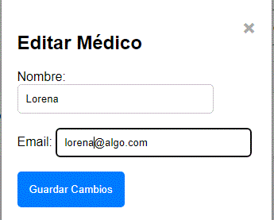
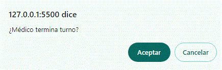
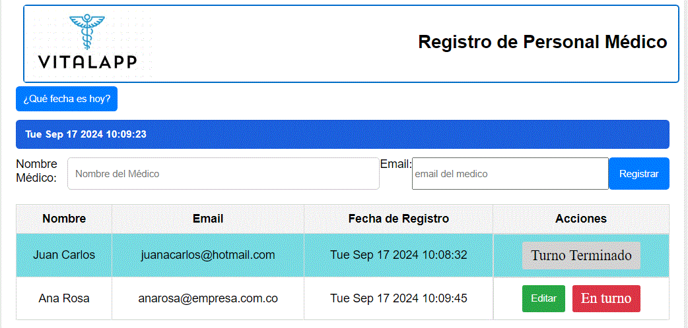

<h1 align="center">CRUD TALENTO TECH</h1>
<h2 align="center">Registro de personal medico</h2>

## Tabla de contenido 
1. [Introducción](#introducción)
2. [Característricas](#características)
3. [Tecnologías utilizadas](#tecnologías-utilizadas)
4. [Como usar la App](#como-usar-la-app)
5. [Codigo](#código)
6. [Despliegue](#despliegue)
7. [Colaboradores](#colaboradores)
   
## Introducción

Este proyecto es una aplicación web simple para registrar y gestionar el personal médico. Permite añadir, editar y marcar como "En turno" a los médicos. Además, proporciona la funcionalidad de editar los detalles de cada médico a través de una ventana modal.


## Características

- Registro de personal médico con nombre, correo electrónico y fecha de registro.
- Edición de registros utilizando una ventana modal.
- Marcar a un médico como "En turno", lo que desactiva el botón de edición correspondiente.
- Validación de campos como el email y la conversión de los nombres a Camel Case.
- Visualización de la fecha actual al hacer clic en el botón "¿Qué fecha es hoy?".

## Tecnologías Utilizadas

- HTML
- CSS
- JavaScript

## Como usar la App

1. **Registro de un médico:**
   - Introduce el nombre y el email del médico en el formulario y haz clic en "Registrar".
   - El médico se añadirá a la lista con la fecha y hora actuales.

     

2. **Editar los detalles de un médico:**
   - Haz clic en el botón "Editar" de la fila correspondiente.
   - Se abrirá una ventana modal donde podrás modificar el nombre y el email.
   - Haz clic en "Guardar Cambios" para aplicar las modificaciones.

     

3. **Marcar a un médico como "Turno Terminado":**
   - Haz clic en el botón "En turno" de la fila correspondiente.
   - La fila se resaltará, y el botón de edición se ocultará, indicando que el médico está en turno.

   

4. **Resultado final al manejar el crud**

   

## Código
El codigo que se utilizo fue el standard para HTML, CSS, JAVASCRIPT.
Para versiones nuevas se manejarán archivos, en formato JSON, con MongoDb, 
o con bases de datos relacionales, en un servidor XAMPP y una base de datos de MySql.

## HTML ##

```html
<!DOCTYPE html>
<html lang="es">
<head>
    <meta charset="UTF-8">
    <meta name="viewport" content="width=device-width, initial-scale=1.0">
    <title>Registro de Personal Médico</title>
    <link rel="stylesheet" href="./style.css">
</head>
<body>
    <div class="container">
        <div class="cont-logo">
            
            <h1 class="reg-personal">Registro de Personal Médico</h1>
        </div>
        <div class="cont-fecha">
            <button class="btn-fecha" onclick="displayDate()">¿Qué fecha es hoy?</button>
            <h2 id="fecha"></h2>
        </div>
        <form id="medicoForm">
            <label for="nombre">Nombre Médico:</label>
            <input type="text" id="nombre" placeholder="Nombre del Médico" size="30" required>
            <label for="nombre">Email:</label>
            <input type="email" id="email" placeholder="email-del-medico" size="35" required>
            <button type="submit">Registrar</button>
        </form>
        <!-- Modal -->
        <div id="editModal" class="modal" style="display:none;">
            <div class="modal-content">
                <span class="close" onclick="closeModal()">&times;</span>
                <h2>Editar Médico</h2>
                <label for="editNombre">Nombre:</label>
                <input type="text" id="editNombre" />
                <br /><br />
                <label for="editEmail">Email:</label>
                <input type="text" id="editEmail" />
                <br /><br />
                <button id="saveEditBtn">Guardar Cambios</button>
            </div>
        </div>
        
        <table widt="100%" rowspan="4">
            <thead>
                <tr>
                    <th>Nombre</th>
                    <th>Email</th>
                    <th>Fecha de Registro</th>
                    <th>Acciones</th>
                </tr>
            </thead>
            <tbody id="medicoList">
                <!-- Aquí se mostrarán los registros -->
            </tbody>
        </table>
    </div>
    <script src="./crud.js"></script>
</body>
</html>
```

## Despliegue

[Ejecutar App](https://ravila64.github.io/crud-talento-tech/)

## Colaboradores

* Yudi Lorena Cruz Taborda
* Paula Katherine Castaño Rozo
* Jorge Alberto Leal
* David Santiago Montoya
* Rene Avila Alonso
  
## Sept, 2024 (R) ##
    
